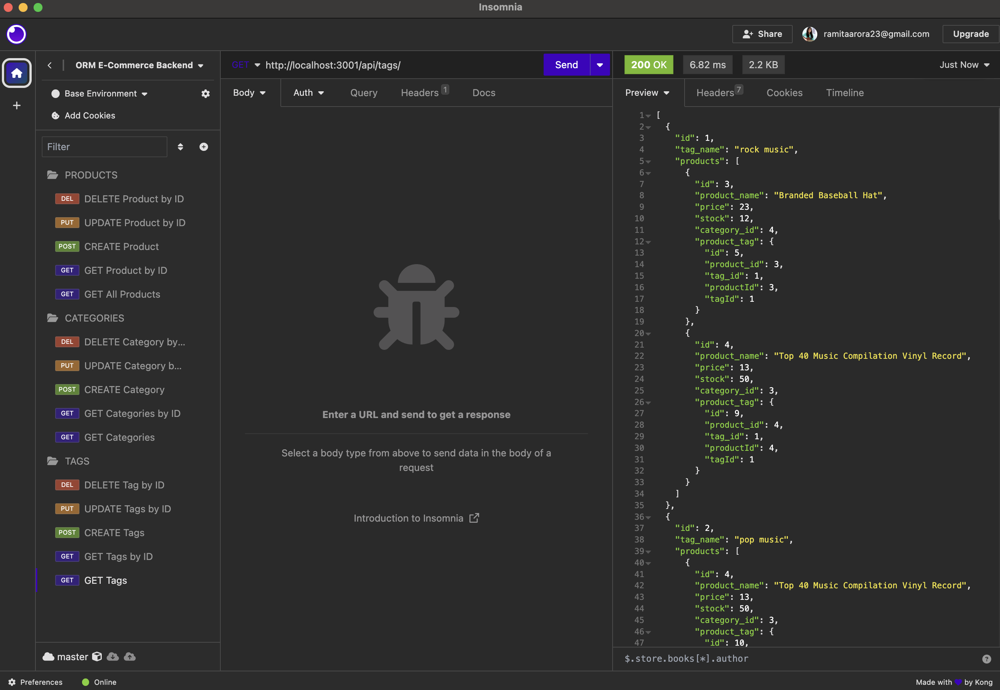

# ORM E-commerce Backend

## UCLA Bootcamp Module 13 Challenge

## Description

This project is a backend for an e-commerice website. It achieves the following:

1. Adds a database name, MySQL username, MySQL password to a .env file to connect to the database using Sequelize.
2. After entering schema and seed commands, the database is created and seeded with test data.
3. After starting the application, the Sequelize models are synced to the MySQL database.
4. The user will be able to use Insomnia for the API GET routes and see the data in a formatted JSON.
5. The user will be able to POST, PUT and DELETE routes in Insomnia to create, update and delete data in the database.

## Installation

To install, run `npm install`.

To seed the database, run `node seeds/index.js`.

To start, run `node server.js`.

## Usage

A video can be viewed at: https://drive.google.com/file/d/1UEFbEEDbE2QXtf0dFctnf8C-Q1wV08on/view

## Credits

This project was created by Ramita Indurkhya.
